# Архітектура та залежності проєкту

Згенеровано автоматично. Аналізовано 150 модулів з архіву.

## 1) Граф залежностей (внутрішні модулі)

```mermaid
graph TD
  app_entrypoint["app.entrypoint"] --> app_run["app.run"]
  app_services_notifications["app.services.notifications"] --> app_services_order_adapter["app.services.order_adapter"]
  app_services_notifications["app.services.notifications"] --> core_execution_signer["core.execution.signer"]
  app_services_order_adapter["app.services.order_adapter"] --> core_positions_position_sizer["core.positions.position_sizer"]
  app_services_order_adapter["app.services.order_adapter"] --> core_risk_guard["core.risk_guard"]
  app_services_order_service["app.services.order_service"] --> app_services_notifications["app.services.notifications"]
  app_services_order_service["app.services.order_service"] --> app_services_order_adapter["app.services.order_adapter"]
  app_services_signal["app.services.signal"] --> core_config_best_params["core.config.best_params"]
  app_services_signal["app.services.signal"] --> core_execution_binance_futures["core.execution.binance_futures"]
  app_services_telemetry["app.services.telemetry"] --> core_telemetry_health["core.telemetry.health"]
  core_config___init__["core.config.__init__"] --> core_execution_binance_futures["core.execution.binance_futures"]
  core_filters_pkg_sets["core.filters_pkg.sets"] --> core_execution_binance_futures["core.execution.binance_futures"]
  core_filters_pkg_sets["core.filters_pkg.sets"] --> core_filters_gates["core.filters.gates"]
  core_live_guard["core.live_guard"] --> core_execution_binance_futures["core.execution.binance_futures"]
  core_logic___init__["core.logic.__init__"] --> core_execution_binance_futures["core.execution.binance_futures"]
  core_paper["core.paper"] --> core_filters_gates["core.filters.gates"]
  core_paper["core.paper"] --> core_positions_portfolio["core.positions.portfolio"]
  core_paper["core.paper"] --> core_risk_guard["core.risk_guard"]
  core_risk___init__["core.risk.__init__"] --> core_execution_binance_futures["core.execution.binance_futures"]
  main["main"] --> app_run["app.run"]
  main["main"] --> core_config_loader["core.config.loader"]
  main["main"] --> core_execution_binance_futures["core.execution.binance_futures"]
  main["main"] --> core_risk_guard["core.risk_guard"]
  scripts_diagnose_entry["scripts.diagnose_entry"] --> app_run["app.run"]
  scripts_diagnostics_leverage_sizer_cli["scripts.diagnostics.leverage_sizer_cli"] --> core_positions_position_sizer["core.positions.position_sizer"]
  scripts_diagnostics_log_preflight["scripts.diagnostics.log_preflight"] --> scripts_diagnostics_preflight_v2["scripts.diagnostics.preflight_v2"]
  scripts_diagnostics_qty_guard_example["scripts.diagnostics.qty_guard_example"] --> core_positions_position_sizer["core.positions.position_sizer"]
  scripts_update_log["scripts.update_log"] --> core_telemetry_update_log["core.telemetry.update_log"]
  tests_app_test_entrypoint["tests.app.test_entrypoint"] --> app_entrypoint["app.entrypoint"]
  tests_app_test_entrypoint["tests.app.test_entrypoint"] --> app_run["app.run"]
  tests_app_test_execution["tests.app.test_execution"] --> app_services_order_service["app.services.order_service"]
  tests_app_test_market_data["tests.app.test_market_data"] --> app_services_order_service["app.services.order_service"]
  tests_app_test_risk["tests.app.test_risk"] --> app_services_risk["app.services.risk"]
  tests_app_test_run_cycle["tests.app.test_run_cycle"] --> app_run["app.run"]
  tests_app_test_signal["tests.app.test_signal"] --> app_services_signal["app.services.signal"]
  tests_app_test_telemetry["tests.app.test_telemetry"] --> core_telemetry_health["core.telemetry.health"]
  tests_core_test_best_params["tests.core.test_best_params"] --> core_config_best_params["core.config.best_params"]
  tests_core_test_config_loader["tests.core.test_config_loader"] --> core_config_loader["core.config.loader"]
  tests_core_test_execution_modules["tests.core.test_execution_modules"] --> core_execution_binance_exec["core.execution.binance_exec"]
  tests_core_test_execution_modules["tests.core.test_execution_modules"] --> core_execution_binance_futures["core.execution.binance_futures"]
  tests_core_test_filters_gates["tests.core.test_filters_gates"] --> core_filters_gates["core.filters.gates"]
  tests_core_test_filters_presets["tests.core.test_filters_presets"] --> core_filters_pkg_sets["core.filters_pkg.sets"]
  tests_core_test_indicators["tests.core.test_indicators"] --> core_indicators["core.indicators"]
  tests_core_test_positions_portfolio["tests.core.test_positions_portfolio"] --> core_positions_portfolio["core.positions.portfolio"]
  tests_core_test_risk_root["tests.core.test_risk_root"] --> core_risk_misc_risk_root["core.risk.misc_risk_root"]
  tests_core_test_symbol_info["tests.core.test_symbol_info"] --> core_exchange_symbol_info["core.exchange.symbol_info"]
  tests_core_test_telemetry_health["tests.core.test_telemetry_health"] --> core_telemetry_health["core.telemetry.health"]
  tests_integration_test_contract_and_smoke["tests.integration.test_contract_and_smoke"] --> core_execution_binance_futures["core.execution.binance_futures"]
  tests_integration_test_contract_and_smoke["tests.integration.test_contract_and_smoke"] --> core_filters_gates["core.filters.gates"]
  tests_integration_test_risk_limits_e2e["tests.integration.test_risk_limits_e2e"] --> app_run["app.run"]
  tests_preflight_test_preflight_env_validation["tests.preflight.test_preflight_env_validation"] --> tools_trades_pull_income_as_trades["tools.trades.pull_income_as_trades"]
  tests_preflight_test_preflight_modules_check["tests.preflight.test_preflight_modules_check"] --> tools_trades_pull_income_as_trades["tools.trades.pull_income_as_trades"]
  tests_preflight_test_preflight_run_artifact["tests.preflight.test_preflight_run_artifact"] --> tools_trades_pull_income_as_trades["tools.trades.pull_income_as_trades"]
  tests_smoke_test_imports["tests.smoke.test_imports"] --> app_run["app.run"]
  tests_smoke_test_imports["tests.smoke.test_imports"] --> core_execution_binance_futures["core.execution.binance_futures"]
  tests_smoke_test_imports["tests.smoke.test_imports"] --> core_indicators["core.indicators"]
  tests_smoke_test_imports["tests.smoke.test_imports"] --> core_precision["core.precision"]
  tests_smoke_test_indicators_smoke["tests.smoke.test_indicators_smoke"] --> core_indicators["core.indicators"]
  tests_test_app_import["tests.test_app_import"] --> app_run["app.run"]
  tests_test_app_run_once["tests.test_app_run_once"] --> app_run["app.run"]
  tests_test_app_run_once["tests.test_app_run_once"] --> core_execution_binance_futures["core.execution.binance_futures"]
  tests_test_executor_service["tests.test_executor_service"] --> app_services_execution["app.services.execution"]
  tests_test_indicators_basic["tests.test_indicators_basic"] --> core_indicators["core.indicators"]
  tests_test_market_data_service["tests.test_market_data_service"] --> app_services_market_data["app.services.market_data"]
  tests_test_risk_gate["tests.test_risk_gate"] --> core_execution_binance_futures["core.execution.binance_futures"]
  tests_test_signal_service["tests.test_signal_service"] --> app_services_signal["app.services.signal"]
  tests_test_telemetry_service["tests.test_telemetry_service"] --> app_services_telemetry["app.services.telemetry"]
  tools_guard_kill_switch["tools.guard.kill_switch"] --> tools_common_env_utils["tools.common.env_utils"]
  tools_health_health_loop["tools.health.health_loop"] --> tools_common_env_utils["tools.common.env_utils"]
  tools_preflight_preflight_all["tools.preflight.preflight_all"] --> tools_common_env_utils["tools.common.env_utils"]
  tools_preflight_preflight_all["tools.preflight.preflight_all"] --> tools_trades_pull_income_as_trades["tools.trades.pull_income_as_trades"]
  tools_trades_pull_from_binance["tools.trades.pull_from_binance"] --> tools_common_env_utils["tools.common.env_utils"]
  tools_trades_pull_income_as_trades["tools.trades.pull_income_as_trades"] --> tools_common_env_utils["tools.common.env_utils"]
```

## 2) Огляд зовнішніх пакетів за файлами (top-level imports)

- `app.entrypoint`: __future__, argparse, logging, os, sys, typing
- `app.ports`: __future__, pandas, typing
- `app.run`: __future__, importlib, logging, os, sys, time, typing
- `app.services.execution`: __future__, datetime, logging, os, pathlib, typing
- `app.services.exit_adapter`: __future__, hashlib, hmac, json, os, ssl, time, urllib
- `app.services.market_data`: __future__, inspect, json, logging, pandas, requests, typing, urllib
- `app.services.notifications`: __future__, importlib, json, os, pathlib, ssl, time, typing, urllib
- `app.services.order_adapter`: __future__, dataclasses, importlib, os, pathlib, time, typing
- `app.services.order_service`: __future__, importlib, os, pathlib, typing
- `app.services.risk`: __future__, typing
- `app.services.signal`: __future__, os, pandas, typing
- `app.services.telemetry`: __future__, logging, pandas, typing
- `core.config.best_params`: __future__
- `core.config.loader`: __future__, dataclasses, os, typing
- `core.env_loader`: __future__, dotenv, os, pathlib
- `core.exchange.symbol_info`: __future__, dataclasses, decimal, typing
- `core.exchange_private`: __future__, binance, os, typing
- `core.execution.binance_exec`: __future__, binance, csv, datetime, functools, json, math, os, time, typing
- `core.execution.binance_futures`: __future__, hashlib, hmac, os, requests, time, typing
- `core.execution.signer`: __future__, hashlib, hmac, time, urllib
- `core.filters.gates`: __future__, dataclasses, datetime, os, pandas, pathlib, typing
- `core.filters_pkg.sets`: __future__, datetime, typing
- `core.indicators`: __future__, dataclasses, numpy, pandas, typing
- `core.indicators.__init__`: __future__, numpy, pandas, typing
- `core.logic.ema_rsi_atr`: __future__, pandas, typing
- `core.paper`: __future__, dataclasses, datetime, pandas, pathlib, typing
- `core.positions.portfolio`: __future__, dataclasses, datetime, inspect, json, pathlib, typing
- `core.positions.position_sizer`: __future__, dataclasses, json, math, os, ssl, typing, urllib
- `core.precision`: __future__, datetime, json, math, os, pathlib, requests, typing
- `core.risk.__init__`: typing
- `core.risk.misc_risk_root`: __future__, typing
- `core.risk_guard`: __future__, dataclasses, datetime, json, os, pathlib, typing
- `core.telemetry.__init__`: __future__, datetime, json, os, pandas, typing
- `core.telemetry.health`: __future__, datetime, json, logging, pathlib, typing
- `core.telemetry.update_log`: __future__, datetime, json, os, pathlib, typing
- `main`: __future__, inspect, logging, os, types, typing
- `scripts.check_binance_client`: binance, os, sys, traceback
- `scripts.diagnose_entry`: __future__, inspect
- `scripts.diagnose_sitecustomize`: importlib, os, sys
- `scripts.diagnostics.analyze_utils`: argparse, ast, collections, datetime, hashlib, json, os, re, sys, textwrap
- `scripts.diagnostics.cancel_all_cli`: __future__, hashlib, hmac, json, os, ssl, sys, time, urllib
- `scripts.diagnostics.inspect_strategy_module`: importlib, inspect, os, sys
- `scripts.diagnostics.leverage_sizer_cli`: __future__, json, os, pathlib, sys
- `scripts.diagnostics.leverage_sizer_standalone`: __future__, json, math, os, ssl, urllib
- `scripts.diagnostics.list_open_orders`: __future__, hashlib, hmac, json, os, ssl, sys, time, urllib
- `scripts.diagnostics.list_positions`: __future__, hashlib, hmac, json, os, ssl, sys, time, urllib
- `scripts.diagnostics.log_preflight`: __future__, importlib, json, os, pathlib, sys, time
- `scripts.diagnostics.order_send_live_auto_cli`: __future__, importlib, json, os, pathlib, sys, time
- `scripts.diagnostics.preflight_v2`: __future__, datetime, json, math, os, ssl, sys, time, urllib
- `scripts.diagnostics.qty_guard_example`: __future__, json, os, pathlib, sys
- `scripts.diagnostics.size_advisor`: __future__, json, math, os, ssl, urllib
- `scripts.maintenance.strip_bom`: __future__, argparse, pathlib, sys
- `scripts.maintenance.upgrade_websockets_imports`: __future__, argparse, pathlib, re, sys
- `scripts.patch_strategy_export`: __future__, io, os, re, shutil, sys
- `scripts.preflight_all`: datetime, hashlib, hmac, importlib, inspect, json, os, pathlib, re, sys, time, urllib
- `scripts.preflight_live`: binance, json, os, pathlib, re, sys, traceback
- `scripts.print_env_locations`: pathlib
- `scripts.print_last_health_links`: glob, os, pathlib
- `scripts.print_last_trading_links`: pathlib
- `scripts.prod_step1_precision`: __future__, datetime, json, os, pathlib
- `scripts.refactor.remove_bridge`: argparse, io, json, os, pathlib, re, shutil, sys
- `scripts.remove_strategy`: __future__, argparse, ast, pathlib, sys
- `scripts.repair_execution_indent`: __future__, datetime, pathlib, re
- `scripts.strip_disabled_paper_lines`: pathlib
- `scripts.tune`: __future__, argparse, json, sys
- `scripts.update_log`: __future__, argparse
- `sitecustomize`: importlib, sys, websockets
- `tests.app.test_atr_risk_budget`: __future__, importlib, json, os
- `tests.app.test_entrypoint`: sys
- `tests.app.test_entrypoint_api`: importlib, os, types
- `tests.app.test_execution`: inspect
- `tests.app.test_market_data`: json, pandas, types
- `tests.app.test_run_cycle`: pandas
- `tests.app.test_run_traderapp_smoke`: importlib, numpy, pandas
- `tests.app.test_services_aux_imports`: importlib
- `tests.app.test_services_execution`: glob, importlib, os, pathlib, shutil
- `tests.app.test_services_market_data`: importlib, json
- `tests.app.test_services_risk`: importlib
- `tests.app.test_services_signal`: importlib, pandas
- `tests.app.test_services_telemetry`: importlib, pandas
- `tests.app.test_signal`: pandas
- `tests.app.test_telemetry`: pathlib
- `tests.conftest`: __future__, numpy, os, pandas, pathlib, pytest, sys, typing
- `tests.core.test_indicators`: importlib, pandas
- `tests.core.test_symbol_info`: inspect
- `tests.integration.test_contract_and_smoke`: importlib, types
- `tests.integration.test_logging_and_health`: importlib, os, pathlib
- `tests.preflight.test_preflight_env_validation`: builtins, importlib, json, os, pathlib, pytest, types
- `tests.preflight.test_preflight_modules_check`: builtins, importlib, pytest, types
- `tests.preflight.test_preflight_run_artifact`: json, os, pathlib, time
- `tests.runtime.test_entrypoint_presence`: importlib, pytest, types
- `tests.runtime.test_run_exec`: os, pytest, subprocess, sys
- `tests.smoke.test_indicators_smoke`: numpy, pandas
- `tests.test_app_run_once`: pandas
- `tests.test_env_minimal`: os, pathlib
- `tests.test_executor_service`: pathlib
- `tests.test_indicators_basic`: numpy, pandas
- `tests.test_market_data_service`: json, types
- `tests.test_risk_gate`: numpy, pandas
- `tests.test_signal_service`: numpy, pandas
- `tests.test_telemetry_service`: pandas
- `tools.common.env_utils`: datetime, json, orjson, os, re, typing
- `tools.guard.kill_switch`: csv, datetime, json, os, pathlib, sys, time
- `tools.health.health_loop`: binance, datetime, json, os, pathlib, sys, time
- `tools.metrics.compute_baseline`: argparse, collections, csv, dataclasses, datetime, json, math, pathlib, sys, typing
- `tools.preflight.binance_checks`: __future__, time
- `tools.preflight.preflight_all`: __future__, datetime, json, os, pathlib, sys, typing
- `tools.trades.export_trades`: argparse, csv, datetime, json, math, pathlib, sys, typing
- `tools.trades.pull_from_binance`: argparse, binance, csv, datetime, math, os, pathlib, sys, typing
- `tools.trades.pull_income_as_trades`: argparse, binance, csv, datetime, os, pathlib, sys

## 3) Опис публічних елементів кожного файлу

### `app.__init__`

**Path:** `app\__init__.py`

### `app.entrypoint`

**Path:** `app\entrypoint.py`

**Imports (top-level):** __future__, app.run, argparse, logging, os, sys, typing
**External packages used:** __future__, argparse, logging, os, sys, typing
**Functions:**
- `_parse_args(argv)`
- `_apply_overrides(args)`
- `main(argv)`

### `app.ports`

**Path:** `app\ports.py`

**Imports (top-level):** __future__, pandas, typing
**External packages used:** __future__, pandas, typing
**Classes:**
- `MarketData : Protocol`
  - `get_klines(self, symbol, interval, limit)`
- `Signal : Protocol`
  - `decide(self, df, params)`
- `RiskGate : Protocol`
  - `can_open(self, decision)`
- `Executor : Protocol`
  - `place(self, decision)`
- `Telemetry : Protocol`
  - `snapshot(self, df)`
  - `decision(self, decision)`
  - `health(self, **payload)`

### `app.run`

**Path:** `app\run.py`

**Imports (top-level):** __future__, importlib, logging, os, sys, time, typing
**External packages used:** __future__, importlib, logging, os, sys, time, typing
**Functions:**
- `_setup_logging()`
- `_try_get_main()`
- `_print_env(logger)`
- `_heartbeat(logger, oneshot)`
- `_is_testish_env()` — Детекція середовища тестів/CI.
- `main()`
**Classes:**
- `TraderApp` — Фасад життєвого циклу бота, сумісний з тестами.
  - `__init__(self, cfg, symbol, interval)`
  - `run_once(self)`
  - `start(self, oneshot)`

### `app.services.__init__`

**Path:** `app\services\__init__.py`

### `app.services.execution`

**Path:** `app\services\execution.py`

**Imports (top-level):** __future__, datetime, logging, os, pathlib, typing
**External packages used:** __future__, datetime, logging, os, pathlib, typing
**Classes:**
- `ExecutionService`
  - `__init__(self, cfg, symbol, logger)`
  - `place(self, decision)`
- `ExecutorService`
  - `__init__(self, symbol, **kwargs)`
  - `_do_place(self, decision)`
  - `place(self, decision)`
  - `place_order(self, decision)`
  - `execute(self, decision)`

### `app.services.exit_adapter`

**Path:** `app\services\exit_adapter.py`

**Imports (top-level):** __future__, hashlib, hmac, json, os, ssl, time, urllib
**External packages used:** __future__, hashlib, hmac, json, os, ssl, time, urllib
**Functions:**
- `_sign(params)`
- `_post(path, params)`
- `_sanitize_exit_payload(d)`
- `preview_exits(symbol, side_entry, sl_price, tp_price)`
- `send_exits(symbol, side_entry, sl_price, tp_price)`

### `app.services.market_data`

**Path:** `app\services\market_data.py`

**Imports (top-level):** __future__, inspect, json, logging, pandas, requests, typing, urllib.parse, urllib.request
**External packages used:** __future__, inspect, json, logging, pandas, requests, typing, urllib
**Functions:**
- `_http_get(url, params, headers, timeout)`
- `_as_df(raw)`
**Classes:**
- `HttpMarketData`
  - `__init__(self, logger)`
  - `get_klines(self, symbol, interval, limit)`

### `app.services.notifications`

**Path:** `app\services\notifications.py`

**Imports (top-level):** __future__, app.services.order_adapter, core.execution.signer, importlib.machinery, json, os, pathlib, ssl, time, typing, urllib
**External packages used:** __future__, importlib, json, os, pathlib, ssl, time, typing, urllib
**Functions:**
- `_load(name, path)`
- `_headers()`
- `_do_post(path, params, signed)`
- `set_leverage_via_rest(symbol, leverage)`
- `place_order_via_rest(symbol, side, otype, wallet_usdt, **kw)` — Returns dict with keys:

### `app.services.order_adapter`

**Path:** `app\services\order_adapter.py`

**Imports (top-level):** __future__, core.positions.position_sizer, core.risk_guard, dataclasses, importlib.machinery, os, pathlib, time, typing
**External packages used:** __future__, dataclasses, importlib, os, pathlib, time, typing
**Functions:**
- `_load(name, path)`
- `_mk_id(prefix)`
- `_fenv(name, default)`
- `_clip(x, lo, hi)`
- `_round_down_to_step(x, step)`
- `_round_up_to_step(x, step)`
- `_apply_atr_budget(sized)` — qty_atr = min(RISK_MAX_POS_USD/price, (risk_budget_day_remaining * k_eff) / (ATR * tick_value))
- `build_order(symbol, side, otype, wallet_usdt, **kw)`

### `app.services.order_service`

**Path:** `app\services\order_service.py`

**Imports (top-level):** __future__, app.services.notifications, app.services.order_adapter, importlib.machinery, os, pathlib, typing
**External packages used:** __future__, importlib, os, pathlib, typing
**Functions:**
- `_load(name, path)`
- `_is_dry_run()`
- `place(symbol, side, otype, wallet_usdt, **kwargs)` — Build order via order_adapter, optionally send via REST if DRY_RUN_ONLY=0.

### `app.services.risk`

**Path:** `app\services\risk.py`

**Imports (top-level):** __future__, typing
**External packages used:** __future__, typing
**Classes:**
- `RiskService`
  - `__init__(self, cfg)`
  - `can_open(self, decision)`

### `app.services.signal`

**Path:** `app\services\signal.py`

**Imports (top-level):** __future__, core.config.best_params, core.logic, os, pandas, typing
**External packages used:** __future__, os, pandas, typing
**Functions:**
- `_select_strategy(name)`
- `_decide_core(df, params)`
**Classes:**
- `SignalService` — Тонкий роутер стратегій. Жодної бізнес-логіки тут.
  - `decide(self, df, params)`
- `SignalService`
  - `decide(self, df, params)`

### `app.services.telemetry`

**Path:** `app\services\telemetry.py`

**Imports (top-level):** __future__, core.telemetry.health, logging, pandas, typing
**External packages used:** __future__, logging, pandas, typing
**Classes:**
- `TelemetryService`
  - `__init__(self, cfg, logger)`
  - `health(self, ok, msg, **extra)`
  - `snapshot(self, df)`
  - `decision(self, data)`

### `core.__init__`

**Path:** `core\__init__.py`

### `core.config.__init__`

**Path:** `core\config\__init__.py`

**Imports (top-level):** .loader

### `core.config.best_params`

**Path:** `core\config\best_params.py`

**Imports (top-level):** __future__
**External packages used:** __future__
**Functions:**
- `get_best_params()` — Return a copy of defaults. Safe to mutate by caller.

### `core.config.loader`

**Path:** `core\config\loader.py`

**Imports (top-level):** __future__, dataclasses, os, typing
**External packages used:** __future__, dataclasses, os, typing
**Functions:**
- `_to_bool(val)`
- `normalize_env(environ)` — Normalize environment variables to a canonical schema in os.environ.
- `load_config()` — Build Config from (already normalized) environment.
- `get_config()`
**Classes:**
- `Config`

### `core.env_loader`

**Path:** `core\env_loader.py`

**Imports (top-level):** __future__, dotenv, os, pathlib
**External packages used:** __future__, dotenv, os, pathlib
**Functions:**
- `_load_with_dotenv(env_path)`
- `_minimal_parse(env_path)`
- `load_env_files()`

### `core.exchange.__init__`

**Path:** `core\exchange\__init__.py`

### `core.exchange.symbol_info`

**Path:** `core\exchange\symbol_info.py`

**Imports (top-level):** __future__, dataclasses, decimal, typing
**External packages used:** __future__, dataclasses, decimal, typing
**Functions:**
- `_dec(x)`
- `from_exchange_info(symbol_info)` — Parse Binance exchangeInfo symbol entry into SymbolFilters.
**Classes:**
- `SymbolFilters`
  - `get(self, key, default)`
  - `to_dict(self)`

### `core.exchange_private`

**Path:** `core\exchange_private.py`

**Imports (top-level):** __future__, binance.client, os, typing
**External packages used:** __future__, binance, os, typing
**Functions:**
- `_bool_env(name, default)`
- `fetch_futures_private()` — Attempt to read futures balances and positions via python-binance.

### `core.execution.binance_exec`

**Path:** `core\execution\binance_exec.py`

**Imports (top-level):** __future__, binance.client, csv, datetime, functools, json, math, os, time, typing
**External packages used:** __future__, binance, csv, datetime, functools, json, math, os, time, typing
**Functions:**
- `_retry_on_exceptions(retries, initial_delay, backoff, retry_on)` — Retry decorator with exponential backoff.
- `ensure_client(testnet)` — Lazily create python-binance Client using env vars.
- `fetch_exchange_info_cached(client, symbol)` — Return {price_step, qty_step, min_qty, min_notional} for symbol via client.futures_exchange_info().
- `log_order(order, tag)` — Append order dict to logs/orders/YYYY-MM-DD.csv (creates file with header if needed).
- `place_entry(cli, symbol, side, qty, price, client_order_id)` — Create a MARKET or LIMIT entry order on USDT-m futures.
- `place_protective(cli, symbol, side, sl, tp, qty, base_client_id)` — Place STOP_MARKET (SL) and TAKE_PROFIT_MARKET (TP) with reduceOnly=True.

### `core.execution.binance_futures`

**Path:** `core\execution\binance_futures.py`

**Imports (top-level):** __future__, hashlib, hmac, os, requests, time, typing
**External packages used:** __future__, hashlib, hmac, os, requests, time, typing
**Functions:**
- `_ts()`
- `_sign(params)`
- `_headers()`
- `_get(path, params, private)`
- `_post(path, params)`
- `ping()`
- `exchange_info(symbol)`
- `klines(symbol, interval, limit)`
- `get_balance(asset)`
- `get_position(symbol)`
- `place_order(symbol, side, quantity, order_type, reduce_only, price, tp, sl, time_in_force, position_side)` — side: BUY/SELL

### `core.execution.signer`

**Path:** `core\execution\signer.py`

**Imports (top-level):** __future__, hashlib, hmac, time, urllib.parse
**External packages used:** __future__, hashlib, hmac, time, urllib
**Functions:**
- `timestamp_ms()`
- `sign_query(secret, params)` — Returns query string with signature appended as 'signature='.

### `core.filters.gates`

**Path:** `core\filters\gates.py`

**Imports (top-level):** __future__, dataclasses, datetime, os, pandas, pathlib, typing
**External packages used:** __future__, dataclasses, datetime, os, pandas, pathlib, typing
**Functions:**
- `_today_dir()`
- `_latest_snapshot_parquet()`
- `_load_snapshot_df()`
- `_parse_hours(hs)`
- `_weekday_ok(cfg, now_utc)`
- `session_gate(now_utc, cfg)`
- `atr_percentile_gate(df, cfg)`
- `htf_trend_gate(df, side, cfg)`
- `evaluate_gates(side, now_utc, cfg)`
**Classes:**
- `GateConfig`

### `core.filters_pkg.__init__`

**Path:** `core\filters_pkg\__init__.py`

### `core.filters_pkg.sets`

**Path:** `core\filters_pkg\sets.py`

**Imports (top-level):** __future__, core.filters, core.filters.gates, datetime, typing
**External packages used:** __future__, datetime, typing
**Functions:**
- `_weekday_gate(now_utc, cfg)`
- `evaluate_preset(side, preset, now_utc, cfg)` — Evaluate a predefined set of gates and return (ok, messages).

### `core.indicators`

**Path:** `core\indicators.py`

**Imports (top-level):** __future__, dataclasses, numpy, pandas, typing
**External packages used:** __future__, dataclasses, numpy, pandas, typing
**Functions:**
- `normalize_numeric(s)` — Coerce to float Series, keep index, preserve NaNs; fill inf with NaN.
- `_span_or_alpha(period)`
- `sma(s, period)`
- `ema(s, period, adjust)`
- `wma(s, period)` — Linear weighted moving average.
- `rma(s, period)` — Wilder's RMA (aka SMMA).
- `rsi(close, period)` — Wilder RSI.
- `tr(high, low, close)` — True Range (vectorized).
- `atr(high, low, close, period)` — Average True Range (Wilder).
- `macd(close, fast, slow, signal)`
- `stoch_kd(high, low, close, k, d)`
- `bbands(close, period, num_std)`
- `dmi(high, low, close, period)` — Directional Movement Index (DI+, DI-).
- `adx(high, low, close, period)`
- `vwap(high, low, close, volume)`
- `roc(series, period)`
- `obv(close, volume)`
- `supertrend(high, low, close, period, multiplier)` — Vectorized-ish supertrend. Returns line and direction (+1/-1).
**Classes:**
- `SupertrendResult`

### `core.indicators.__init__`

**Path:** `core\indicators\__init__.py`

**Imports (top-level):** __future__, numpy, pandas, typing
**External packages used:** __future__, numpy, pandas, typing
**Functions:**
- `ema(s, span)`
- `rsi(close, period)`
- `atr(df_or_high, period, low, close)` — Compatibility ATR.
- `atr(*args, **kwargs)`

### `core.live_guard`

**Path:** `core\live_guard.py`

**Imports (top-level):** .risk
**Functions:**
- `guard_before_entry(equity_fetcher)`

### `core.logic.__init__`

**Path:** `core\logic\__init__.py`

**Imports (top-level):** .ema_rsi_atr

### `core.logic.ema_rsi_atr`

**Path:** `core\logic\ema_rsi_atr.py`

**Imports (top-level):** __future__, pandas, typing
**External packages used:** __future__, pandas, typing
**Functions:**
- `_ema(s, span)`
- `_rsi(close, period)`
- `_atr(df, period)`
- `generate_signal(df, params)` — EMA/RSI/ATR стратегія з розрахунком SL/TP.
- `decide(*args, **kwargs)`
- `signal(*args, **kwargs)`
- `_pick_col(df, *cands)`
- `_ensure_ohlc(df)`
- `_atr(df, period)` — Robust ATR: supports various OHLC column namings; if only 'close' exists,
**Classes:**
- `Strategy` — Unified interface for the trading runner. Generated adapter.
  - `decide(*args, **kwargs)`

### `core.paper`

**Path:** `core\paper.py`

**Imports (top-level):** __future__, core.filters.gates, core.positions.portfolio, core.risk_guard, dataclasses, datetime, pandas, pathlib, typing
**External packages used:** __future__, dataclasses, datetime, pandas, pathlib, typing
**Functions:**
- `_compat_can_open(risk_obj, **kwargs)` — Tries multiple signatures for risk.can_open to maintain backward compatibility.
- `_today_str()`
- `_ensure_parent(p)`
- `_df_effectively_empty(df)`
- `_safe_concat(a, b)`
- `append_order_csv(path, row)`
- `append_equity_csv(path, row)`
**Classes:**
- `PaperConfig`
  - `__post_init__(self)`
- `PaperTrader` — Lifecycle & PnL in paper mode with risk gating and strategy gates.
  - `__init__(self, symbol, cfg)`
  - `_apply_slip(price, side, is_entry, slip_bps)`
  - `_order_path(self)`
  - `_equity_path(self)`
  - `_write_equity(self, tss, price, side, qty)`
  - `_open(self, tss, side, entry_px, qty, sl, tp, reason)`
  - `_close(self, tss, pos, exit_px, reason)`
  - `on_bar(self, bar, decision)`

### `core.params_loader`

**Path:** `core\params_loader.py`

### `core.positions.portfolio`

**Path:** `core\positions\portfolio.py`

**Imports (top-level):** __future__, dataclasses, datetime, inspect, json, pathlib, typing
**External packages used:** __future__, dataclasses, datetime, inspect, json, pathlib, typing
**Classes:**
- `Position`
  - `as_dict(self)`
  - `is_long(self)`
  - `check_exit_on_bar(self, high, low)` — Return (should_close, exit_price, reason) by SL/TP hit using candle extremes.
- `PortfolioState` — Persist current paper position per symbol to logs/paper/state.json
  - `__init__(self, symbol, path)`
  - `_load(self)`
  - `save(self)`
  - `get_position(self)`
  - `set_position(self, pos)`

### `core.positions.position_sizer`

**Path:** `core\positions\position_sizer.py`

**Imports (top-level):** __future__, dataclasses, json, math, os, ssl, typing, urllib.request
**External packages used:** __future__, dataclasses, json, math, os, ssl, typing, urllib
**Functions:**
- `_http_json(url, timeout)`
- `public_price(symbol)`
- `public_filters(symbol)`
- `_round_up(x, step)`
- `compute_qty_leverage(symbol, wallet_usdt, get_price, get_filters, cfg)`
**Classes:**
- `SizerConfig`
- `SizerResult`

### `core.precision`

**Path:** `core\precision.py`

**Imports (top-level):** __future__, datetime, json, math, os, pathlib, requests, typing
**External packages used:** __future__, datetime, json, math, os, pathlib, requests, typing
**Functions:**
- `_now_iso()`
- `_load_cache()`
- `_save_cache()`
- `_fetch_exchange_info(symbol)`
- `_to_float(s, default)`
- `_parse_filters(sym)`
- `get_filters(symbol, force_refresh)`
- `_round_to_step(x, step)`
- `round_price(price, filters)`
- `round_qty(qty, filters)`
- `enforce_min_notional(qty, price, filters)`

### `core.risk.__init__`

**Path:** `core\risk\__init__.py`

**Imports (top-level):** ..precision, .limits, typing
**External packages used:** typing
**Functions:**
- `_to_tuple(result)` — Normalize various result shapes to (allowed: bool, reason: str).
- `can_open_new_trade(*args, **kwargs)` — Compatibility wrapper returning (allowed: bool, reason: str).

### `core.risk.misc_risk_root`

**Path:** `core\risk\misc_risk_root.py`

**Imports (top-level):** __future__, typing
**External packages used:** __future__, typing
**Functions:**
- `can_open(decision)` — Basic guard: allow only LONG/SHORT with qty>0 if provided.

### `core.risk_guard`

**Path:** `core\risk_guard.py`

**Imports (top-level):** __future__, dataclasses, datetime, json, os, pathlib, typing
**External packages used:** __future__, dataclasses, datetime, json, os, pathlib, typing
**Functions:**
- `_get_float(name, default)`
- `_get_int(name, default)`
- `_now_utc()`
- `is_killed()` — True if the kill flag is present (block new orders).
- `kill(reason, context)` — Create/overwrite kill flag and log an event (idempotent).
- `clear_kill()`
- `log_event(kind, payload)`
- `daily_limits_blocked(state)`
- `position_cap_ok(notional_usd, equity_usd)`
- `compute_sl_tp(entry_price, side, atr)`
- `guard_and_enrich(plan, state)` — Return (allowed, possibly_modified_plan, reason).
- `evaluate(metrics)` — Evaluate risk constraints from generic metrics dict.
**Classes:**
- `AccountState`
- `OrderPlan`

### `core.telemetry.__init__`

**Path:** `core\telemetry\__init__.py`

**Imports (top-level):** __future__, datetime, json, os, pandas, typing
**External packages used:** __future__, datetime, json, os, pandas, typing
**Functions:**
- `_ensure_dir(path)`
- `_utc_now_parts()`
- `save_snapshot(*args, **kwargs)` — Лайтова версія: шукає DataFrame у args/kwargs і зберігає його в logs/snapshots/<date>/snapshot_<time>.(csv|parquet)
- `log_decision(*args, **kwargs)` — Лайт-логер рішення: шукає dict (або об'єкт з .__dict__) і апендить JSON у logs/health/<date>/health_<time>.jsonl.

### `core.telemetry.health`

**Path:** `core\telemetry\health.py`

**Imports (top-level):** __future__, datetime, json, logging, pathlib, typing
**External packages used:** __future__, datetime, json, logging, pathlib, typing
**Functions:**
- `_now_iso()`
- `_ensure_dir(path)`
- `log_health(**fields)` — Log a health event (JSONL + std logger).

### `core.telemetry.update_log`

**Path:** `core\telemetry\update_log.py`

**Imports (top-level):** __future__, datetime, json, os, pathlib, typing
**External packages used:** __future__, datetime, json, os, pathlib, typing
**Functions:**
- `_now_iso()`
- `_as_list(x)`
- `log_update(step, files, notes, tags)` — Write a single changelog entry into logs/updates as JSONL and Markdown.

### `core.utils.filters_patch`

**Path:** `core\utils\filters_patch.py`

**Functions:**
- `ensure_filters_get(filters_obj)`

### `main`

**Path:** `main.py`

**Imports (top-level):** __future__, app.run, core.config.loader, core.risk, core.risk_guard, inspect, logging, os, types, typing
**External packages used:** __future__, inspect, logging, os, types, typing
**Functions:**
- `_read_any(cfg, lower, upper, default)`
- `_as_bool(v, default)`
- `_as_int(v, default)`
- `_normalize_config_view(cfg)`
- `main()`

### `scripts.check_binance_client`

**Path:** `scripts\check_binance_client.py`

**Imports (top-level):** binance.client, os, sys, traceback
**External packages used:** binance, os, sys, traceback
**Functions:**
- `main()`

### `scripts.diagnose_entry`

**Path:** `scripts\diagnose_entry.py`

**Imports (top-level):** __future__, app.run, inspect
**External packages used:** __future__, inspect

### `scripts.diagnose_sitecustomize`

**Path:** `scripts\diagnose_sitecustomize.py`

**Imports (top-level):** importlib, os, sys
**External packages used:** importlib, os, sys
**Functions:**
- `main()`

### `scripts.diagnostics.analyze_utils`

**Path:** `scripts\diagnostics\analyze_utils.py`

**Imports (top-level):** argparse, ast, collections, datetime, hashlib, json, os, re, sys, textwrap
**External packages used:** argparse, ast, collections, datetime, hashlib, json, os, re, sys, textwrap
**Functions:**
- `sha1(path)`
- `read(path)`
- `list_py(root)`
- `public_symbols(tree)`
- `is_stub_node(node)`
- `file_loc_stats(text)`
- `main()`

### `scripts.diagnostics.cancel_all_cli`

**Path:** `scripts\diagnostics\cancel_all_cli.py`

**Imports (top-level):** __future__, hashlib, hmac, json, os, ssl, sys, time, urllib, urllib.parse
**External packages used:** __future__, hashlib, hmac, json, os, ssl, sys, time, urllib
**Functions:**
- `_headers()`
- `_signed_qs(params)`
- `_get(path, params)`
- `_post(path, params)`
- `main()`
- `_delete_all(symbol)`

### `scripts.diagnostics.inspect_strategy_module`

**Path:** `scripts\diagnostics\inspect_strategy_module.py`

**Imports (top-level):** importlib, inspect, os, sys
**External packages used:** importlib, inspect, os, sys

### `scripts.diagnostics.leverage_sizer_cli`

**Path:** `scripts\diagnostics\leverage_sizer_cli.py`

**Imports (top-level):** __future__, core.positions.position_sizer, json, os, pathlib, sys
**External packages used:** __future__, json, os, pathlib, sys
**Functions:**
- `main()`

### `scripts.diagnostics.leverage_sizer_standalone`

**Path:** `scripts\diagnostics\leverage_sizer_standalone.py`

**Imports (top-level):** __future__, json, math, os, ssl, urllib.request
**External packages used:** __future__, json, math, os, ssl, urllib
**Functions:**
- `_get(url)`
- `price(symbol)`
- `filters(symbol)`
- `round_up(x, step)`
- `err(msg, code)`
- `main()`

### `scripts.diagnostics.list_open_orders`

**Path:** `scripts\diagnostics\list_open_orders.py`

**Imports (top-level):** __future__, hashlib, hmac, json, os, ssl, sys, time, urllib, urllib.parse
**External packages used:** __future__, hashlib, hmac, json, os, ssl, sys, time, urllib
**Functions:**
- `_headers()`
- `_signed_qs(params)`
- `_get(path, params)`
- `_post(path, params)`
- `main()`

### `scripts.diagnostics.list_positions`

**Path:** `scripts\diagnostics\list_positions.py`

**Imports (top-level):** __future__, hashlib, hmac, json, os, ssl, sys, time, urllib, urllib.parse
**External packages used:** __future__, hashlib, hmac, json, os, ssl, sys, time, urllib
**Functions:**
- `_headers()`
- `_signed_qs(params)`
- `_get(path, params)`
- `_post(path, params)`
- `main()`

### `scripts.diagnostics.log_preflight`

**Path:** `scripts\diagnostics\log_preflight.py`

**Imports (top-level):** __future__, importlib.machinery, json, os, pathlib, scripts.diagnostics.preflight_v2, sys, time
**External packages used:** __future__, importlib, json, os, pathlib, sys, time
**Functions:**
- `run_preflight_capture()`
- `main()`

### `scripts.diagnostics.log_sizer`

**Path:** `scripts\diagnostics\log_sizer.py`

### `scripts.diagnostics.order_dry_run`

**Path:** `scripts\diagnostics\order_dry_run.py`

### `scripts.diagnostics.order_preview_cli`

**Path:** `scripts\diagnostics\order_preview_cli.py`

### `scripts.diagnostics.order_send_cli`

**Path:** `scripts\diagnostics\order_send_cli.py`

### `scripts.diagnostics.order_send_live_auto_cli`

**Path:** `scripts\diagnostics\order_send_live_auto_cli.py`

**Imports (top-level):** __future__, importlib.machinery, json, os, pathlib, sys, time
**External packages used:** __future__, importlib, json, os, pathlib, sys, time
**Functions:**
- `_lm(name, path)`
- `envf(name, default, cast)`
- `main()`

### `scripts.diagnostics.order_send_live_cli`

**Path:** `scripts\diagnostics\order_send_live_cli.py`

### `scripts.diagnostics.preflight_v2`

**Path:** `scripts\diagnostics\preflight_v2.py`

**Imports (top-level):** __future__, datetime, json, math, os, ssl, sys, time, urllib.request
**External packages used:** __future__, datetime, json, math, os, ssl, sys, time, urllib
**Functions:**
- `_get(url)`
- `server_time_ms()`
- `ping_ok()`
- `exchange_info(symbol)`
- `price(symbol)`
- `filters_map(ex_info, symbol)`
- `now_ms()`
- `human_ts(ms)`
- `check_time_drift()`
- `check_symbol_filters(fs, px)`
- `main()`

### `scripts.diagnostics.qty_guard_example`

**Path:** `scripts\diagnostics\qty_guard_example.py`

**Imports (top-level):** __future__, core.positions.position_sizer, json, os, pathlib, sys
**External packages used:** __future__, json, os, pathlib, sys
**Functions:**
- `main()`

### `scripts.diagnostics.risk_guard_check`

**Path:** `scripts\diagnostics\risk_guard_check.py`

### `scripts.diagnostics.set_tp_sl_cli`

**Path:** `scripts\diagnostics\set_tp_sl_cli.py`

### `scripts.diagnostics.size_advisor`

**Path:** `scripts\diagnostics\size_advisor.py`

**Imports (top-level):** __future__, json, math, os, ssl, urllib.request
**External packages used:** __future__, json, math, os, ssl, urllib
**Functions:**
- `_get(url)`
- `price(symbol)`
- `filters(symbol)`
- `round_up(x, step)`
- `main()`

### `scripts.diagnostics.trade_once`

**Path:** `scripts\diagnostics\trade_once.py`

### `scripts.diagnostics.verify_strategy_imports`

**Path:** `scripts\diagnostics\verify_strategy_imports.py`

### `scripts.maintenance.strip_bom`

**Path:** `scripts\maintenance\strip_bom.py`

**Imports (top-level):** __future__, argparse, pathlib, sys
**External packages used:** __future__, argparse, pathlib, sys
**Functions:**
- `has_bom(data)`
- `process_file(p, write)`
- `walk(root, exts)`
- `main(argv)`

### `scripts.maintenance.upgrade_websockets_imports`

**Path:** `scripts\maintenance\upgrade_websockets_imports.py`

**Imports (top-level):** __future__, argparse, pathlib, re, sys
**External packages used:** __future__, argparse, pathlib, re, sys
**Functions:**
- `iter_py_files(project_root)`
- `transform_lines(lines)`
- `main()`

### `scripts.patch_strategy_export`

**Path:** `scripts\patch_strategy_export.py`

**Imports (top-level):** __future__, io, os, re, shutil, sys
**External packages used:** __future__, io, os, re, shutil, sys
**Functions:**
- `main(project_root)`

### `scripts.preflight_all`

**Path:** `scripts\preflight_all.py`

**Imports (top-level):** datetime, hashlib, hmac, importlib, inspect, json, os, pathlib, re, sys, time, urllib.parse, urllib.request
**External packages used:** datetime, hashlib, hmac, importlib, inspect, json, os, pathlib, re, sys, time, urllib
**Functions:**
- `write_json(name, obj)`
- `getenv_bool(v, default)`
- `parse_number(s)`
- `required_keys_check(env)`
- `validate_modes(env)`
- `validate_risk(env)`
- `http_get_json(url, headers, timeout)`
- `binance_server_time()`
- `binance_exchange_info()`
- `sign_params(params, secret)`
- `binance_account_ping(key, secret)`
- `load_env_via_canonical_module()`
- `main()`

### `scripts.preflight_live`

**Path:** `scripts\preflight_live.py`

**Imports (top-level):** binance.client, json, os, pathlib, re, sys, traceback
**External packages used:** binance, json, os, pathlib, re, sys, traceback
**Functions:**
- `_check_shadowing(root)`
- `_load_dotenv()`
- `main()`

### `scripts.print_env_locations`

**Path:** `scripts\print_env_locations.py`

**Imports (top-level):** pathlib
**External packages used:** pathlib
**Functions:**
- `main()`

### `scripts.print_last_health_links`

**Path:** `scripts\print_last_health_links.py`

**Imports (top-level):** glob, os, pathlib
**External packages used:** glob, os, pathlib
**Functions:**
- `to_file_uri(p)`

### `scripts.print_last_trading_links`

**Path:** `scripts\print_last_trading_links.py`

**Imports (top-level):** pathlib
**External packages used:** pathlib
**Functions:**
- `to_uri(p)`

### `scripts.prod_step1_precision`

**Path:** `scripts\prod_step1_precision.py`

**Imports (top-level):** __future__, datetime, json, os, pathlib
**External packages used:** __future__, datetime, json, os, pathlib
**Functions:**
- `backup(path)`
- `ensure_precision_module()`
- `patch_run_import_and_init()`
- `main()`

### `scripts.refactor.remove_bridge`

**Path:** `scripts\refactor\remove_bridge.py`

**Imports (top-level):** argparse, io, json, os, pathlib, re, shutil, sys
**External packages used:** argparse, io, json, os, pathlib, re, shutil, sys
**Functions:**
- `inline_block(indent, lhs, args)`
- `process_text(text)`
- `main()`

### `scripts.remove_strategy`

**Path:** `scripts\remove_strategy.py`

**Imports (top-level):** __future__, argparse, ast, pathlib, sys
**External packages used:** __future__, argparse, ast, pathlib, sys
**Functions:**
- `_imports_strategy(path)`
- `find_real_refs()`
- `main()`

### `scripts.repair_execution_indent`

**Path:** `scripts\repair_execution_indent.py`

**Imports (top-level):** __future__, datetime, pathlib, re
**External packages used:** __future__, datetime, pathlib, re
**Functions:**
- `main()`

### `scripts.run.loop_live_safe`

**Path:** `scripts\run\loop_live_safe.py`

### `scripts.run.loop_preview`

**Path:** `scripts\run\loop_preview.py`

### `scripts.strip_disabled_paper_lines`

**Path:** `scripts\strip_disabled_paper_lines.py`

**Imports (top-level):** pathlib
**External packages used:** pathlib
**Functions:**
- `skip(p)`

### `scripts.tune`

**Path:** `scripts\tune.py`

**Imports (top-level):** __future__, argparse, json, sys
**External packages used:** __future__, argparse, json, sys
**Functions:**
- `main()`

### `scripts.update_log`

**Path:** `scripts\update_log.py`

**Imports (top-level):** __future__, argparse, core.telemetry.update_log
**External packages used:** __future__, argparse
**Functions:**
- `main()`

### `sitecustomize`

**Path:** `sitecustomize.py`

**Imports (top-level):** importlib, sys, websockets
**External packages used:** importlib, sys, websockets

### `tests.app.test_atr_risk_budget`

**Path:** `tests\app\test_atr_risk_budget.py`

**Imports (top-level):** __future__, importlib, json, os
**External packages used:** __future__, importlib, json, os
**Functions:**
- `_place(symbol, **kwargs)` — Виклик app.services.order_service.place(...) з DRY_RUN_ONLY=1 і повернення прев’ю.
- `test_atr_budget_applied_true_when_cap_allows(monkeypatch)` — Коли CAP достатній (наприклад, 200$ на BTCUSDT), маємо applied=True
- `test_atr_budget_blocks_when_cap_below_exchange_min(monkeypatch)` — Коли CAP занадто малий (100$ на BTCUSDT), CAP < min_qty => applied=False, reason=cap_below_exchange_min,
- `test_atr_budget_bad_inputs(monkeypatch)` — Погані інпути (atr<=0) вимикають ATR-бюджет (applied=False, reason=bad_inputs).
- `test_qty_never_exceeds_cap(monkeypatch)` — Перевіряємо, що навіть при великих risk_budget та маленькому ATR кількість не перевищує CAP.
- `test_kill_switch_blocks_trade(monkeypatch)` — Kill-switch має пріоритет: при наявності run/TRADE_KILLED.flag risk_gate.can_trade=False незалежно від ATR.

### `tests.app.test_entrypoint`

**Path:** `tests\app\test_entrypoint.py`

**Imports (top-level):** app.entrypoint, app.run, sys
**External packages used:** sys
**Functions:**
- `test_entrypoint_main_runs_once(monkeypatch)`

### `tests.app.test_entrypoint_api`

**Path:** `tests\app\test_entrypoint_api.py`

**Imports (top-level):** importlib, os, types
**External packages used:** importlib, os, types
**Functions:**
- `test_entrypoint_exports()`
- `test_apply_overrides_sets_env(monkeypatch)`

### `tests.app.test_execution`

**Path:** `tests\app\test_execution.py`

**Imports (top-level):** app.services, inspect
**External packages used:** inspect
**Functions:**
- `test_execution_has_callable_place_like()`

### `tests.app.test_market_data`

**Path:** `tests\app\test_market_data.py`

**Imports (top-level):** app.services, json, pandas, types
**External packages used:** json, pandas, types
**Functions:**
- `test_http_market_data_public_rest(monkeypatch)`

### `tests.app.test_risk`

**Path:** `tests\app\test_risk.py`

**Imports (top-level):** app.services.risk
**Functions:**
- `test_risk_can_open_basic()`

### `tests.app.test_run_cycle`

**Path:** `tests\app\test_run_cycle.py`

**Imports (top-level):** app.run, pandas
**External packages used:** pandas
**Functions:**
- `test_traderapp_run_once_exec_called(monkeypatch, df_klines)`

### `tests.app.test_run_traderapp_smoke`

**Path:** `tests\app\test_run_traderapp_smoke.py`

**Imports (top-level):** importlib, numpy, pandas
**External packages used:** importlib, numpy, pandas
**Functions:**
- `test_traderapp_run_once_exec_called(monkeypatch)`
**Classes:**
- `FakeMD`
  - `get_klines(self, symbol, interval, limit)`
- `FakeSIG`
  - `decide(self, df, params)`
- `FakeRISK`
  - `can_open(self, decision)`
- `FakeEXE`
  - `__init__(self)`
  - `place(self, decision)`
- `FakeTEL`
  - `health(self, ok, msg, **kw)`
  - `decision(self, data)`
  - `snapshot(self, df)`

### `tests.app.test_services_aux_imports`

**Path:** `tests\app\test_services_aux_imports.py`

**Imports (top-level):** importlib
**External packages used:** importlib
**Functions:**
- `test_app_services_aux_modules_import()`

### `tests.app.test_services_execution`

**Path:** `tests\app\test_services_execution.py`

**Imports (top-level):** glob, importlib, os, pathlib, shutil
**External packages used:** glob, importlib, os, pathlib, shutil
**Functions:**
- `test_executor_service_writes_orders_csv(tmp_path, monkeypatch)`

### `tests.app.test_services_market_data`

**Path:** `tests\app\test_services_market_data.py`

**Imports (top-level):** importlib, json
**External packages used:** importlib, json
**Functions:**
- `test_http_market_data_get_klines_mock(monkeypatch)`

### `tests.app.test_services_risk`

**Path:** `tests\app\test_services_risk.py`

**Imports (top-level):** importlib
**External packages used:** importlib
**Functions:**
- `test_risk_can_open_contract()`

### `tests.app.test_services_signal`

**Path:** `tests\app\test_services_signal.py`

**Imports (top-level):** importlib, pandas
**External packages used:** importlib, pandas
**Functions:**
- `test_signal_service_decide_shape(df_klines)`

### `tests.app.test_services_telemetry`

**Path:** `tests\app\test_services_telemetry.py`

**Imports (top-level):** importlib, pandas
**External packages used:** importlib, pandas
**Functions:**
- `test_telemetry_service_api(df_klines)`

### `tests.app.test_signal`

**Path:** `tests\app\test_signal.py`

**Imports (top-level):** app.services.signal, pandas
**External packages used:** pandas
**Functions:**
- `test_signal_decision_contains_required_keys(df_klines)`

### `tests.app.test_telemetry`

**Path:** `tests\app\test_telemetry.py`

**Imports (top-level):** core.telemetry.health, pathlib
**External packages used:** pathlib
**Functions:**
- `test_health_writes_jsonl(tmp_path)`

### `tests.conftest`

**Path:** `tests\conftest.py`

**Imports (top-level):** __future__, numpy, os, pandas, pathlib, pytest, sys, typing
**External packages used:** __future__, numpy, os, pandas, pathlib, pytest, sys, typing
**Functions:**
- `_force_root_cwd_and_syspath()` — Гарантує, що кожен тест виконується з CWD = корінь репозиторію,
- `_gen_klines(n, start_price, step)` — Створює детермінований DataFrame з колонками:
- `df_klines()` — Синтетичні котирування для тестів (200 рядків, стовпці як у kline).

### `tests.core.test_best_params`

**Path:** `tests\core\test_best_params.py`

**Imports (top-level):** core.config.best_params
**Functions:**
- `test_best_params_module_imports()`

### `tests.core.test_config_loader`

**Path:** `tests\core\test_config_loader.py`

**Imports (top-level):** core.config.loader
**Functions:**
- `test_config_loader_callable()`

### `tests.core.test_execution_modules`

**Path:** `tests\core\test_execution_modules.py`

**Imports (top-level):** core.execution.binance_exec, core.execution.binance_futures
**Functions:**
- `test_execution_modules_importable()`

### `tests.core.test_filters_gates`

**Path:** `tests\core\test_filters_gates.py`

**Imports (top-level):** core.filters.gates
**Functions:**
- `test_filters_gates_has_callables()`

### `tests.core.test_filters_presets`

**Path:** `tests\core\test_filters_presets.py`

**Imports (top-level):** core.filters_pkg.sets
**Functions:**
- `test_filters_presets_importable_and_evaluable(monkeypatch, tmp_path)`

### `tests.core.test_indicators`

**Path:** `tests\core\test_indicators.py`

**Imports (top-level):** core.indicators, core.indicators.indicators, importlib, pandas
**External packages used:** importlib, pandas
**Functions:**
- `_find_indicators_module()`
- `test_indicators_basic()`

### `tests.core.test_logic_modules`

**Path:** `tests\core\test_logic_modules.py`

### `tests.core.test_positions_portfolio`

**Path:** `tests\core\test_positions_portfolio.py`

**Imports (top-level):** core.positions.portfolio
**Functions:**
- `test_positions_portfolio_importable()`

### `tests.core.test_risk_root`

**Path:** `tests\core\test_risk_root.py`

**Imports (top-level):** core.risk.misc_risk_root
**Functions:**
- `test_risk_root_has_can_open_like()`

### `tests.core.test_symbol_info`

**Path:** `tests\core\test_symbol_info.py`

**Imports (top-level):** core.exchange.symbol_info, inspect
**External packages used:** inspect
**Functions:**
- `test_symbol_info_api_present()`

### `tests.core.test_telemetry_health`

**Path:** `tests\core\test_telemetry_health.py`

**Imports (top-level):** core.telemetry.health
**Functions:**
- `test_telemetry_health_importable_and_callable(tmp_path, monkeypatch)`

### `tests.integration.test_contract_and_smoke`

**Path:** `tests\integration\test_contract_and_smoke.py`

**Imports (top-level):** core.filters.gates, core.risk, importlib, types
**External packages used:** importlib, types
**Functions:**
- `has_any_attr(obj, names)`
- `test_app_run_contract_smoke()` — Contract smoke: app.run should expose at least one runnable hook.
- `test_strategy_module_imports_smoke()` — Ensure strategy module and indicators import cleanly.
- `test_filters_and_risk_basic_symbols()` — Quick sanity checks on exported names to catch missing renames.

### `tests.integration.test_logging_and_health`

**Path:** `tests\integration\test_logging_and_health.py`

**Imports (top-level):** importlib, os, pathlib
**External packages used:** importlib, os, pathlib
**Functions:**
- `test_decision_log_folder_exists()`
- `test_health_module_imports()`

### `tests.integration.test_risk_limits_e2e`

**Path:** `tests\integration\test_risk_limits_e2e.py`

**Imports (top-level):** app.run
**Functions:**
- `test_consecutive_losses_block_after_threshold(df_klines)`
- `test_daily_loss_cap_blocks(df_klines)`
**Classes:**
- `FakeMD`
  - `__init__(self, df)`
  - `get_klines(self, symbol, interval, limit)`
- `FakeSIG`
  - `__init__(self, price)`
  - `decide(self, df, params)`
- `CountingEXE`
  - `__init__(self)`
  - `place(self, decision)`
- `NoopTEL`
  - `snapshot(self, df)`
  - `decision(self, d)`
  - `health(self, ok, msg, **kw)`

### `tests.preflight.test_preflight_env_validation`

**Path:** `tests\preflight\test_preflight_env_validation.py`

**Imports (top-level):** builtins, importlib, json, os, pathlib, pytest, tools.preflight, types
**External packages used:** builtins, importlib, json, os, pathlib, pytest, types
**Functions:**
- `test_validate_env_minimal_live_ok(tmp_path, monkeypatch)`
- `test_validate_env_paper_no_creds_ok(monkeypatch)`

### `tests.preflight.test_preflight_modules_check`

**Path:** `tests\preflight\test_preflight_modules_check.py`

**Imports (top-level):** builtins, importlib, pytest, tools.preflight, types
**External packages used:** builtins, importlib, pytest, types
**Functions:**
- `test_check_modules_happy(monkeypatch)`
**Classes:**
- `_Dummy`

### `tests.preflight.test_preflight_run_artifact`

**Path:** `tests\preflight\test_preflight_run_artifact.py`

**Imports (top-level):** json, os, pathlib, time, tools.preflight
**External packages used:** json, os, pathlib, time
**Functions:**
- `test_run_writes_artifact(tmp_path, monkeypatch)`

### `tests.runtime.test_entrypoint_presence`

**Path:** `tests\runtime\test_entrypoint_presence.py`

**Imports (top-level):** importlib, pytest, types
**External packages used:** importlib, pytest, types
**Functions:**
- `_find_callable()`
- `test_entrypoint_callable_present()` — Checks that at least one entrypoint exists: app.entrypoint:main, app.app:main, or app.bootstrap:main.

### `tests.runtime.test_run_exec`

**Path:** `tests\runtime\test_run_exec.py`

**Imports (top-level):** os, pytest, subprocess, sys
**External packages used:** os, pytest, subprocess, sys
**Functions:**
- `test_run_module_produces_output(monkeypatch)` — Ensures that `python -m app.run` does not exit silently:

### `tests.smoke.test_imports`

**Path:** `tests\smoke\test_imports.py`

**Imports (top-level):** app.run, core, core.indicators, core.precision
**Functions:**
- `test_import_app()`
- `test_import_core()`

### `tests.smoke.test_indicators_smoke`

**Path:** `tests\smoke\test_indicators_smoke.py`

**Imports (top-level):** core.indicators, numpy, pandas
**External packages used:** numpy, pandas
**Functions:**
- `test_indicators_rsi_ema()`

### `tests.smoke.test_strategy_smoke`

**Path:** `tests\smoke\test_strategy_smoke.py`

### `tests.test_app_import`

**Path:** `tests\test_app_import.py`

**Imports (top-level):** app.run
**Functions:**
- `test_import_app_and_trader()`

### `tests.test_app_run_once`

**Path:** `tests\test_app_run_once.py`

**Imports (top-level):** app.run, core.config, pandas
**External packages used:** pandas
**Functions:**
- `test_traderapp_run_once_with_fakes(monkeypatch)`
**Classes:**
- `FakeMD`
  - `get_klines(self, symbol, interval, limit)`
- `FakeSIG`
  - `decide(self, df, params)`
- `FakeRISK`
  - `can_open(self, decision)`
- `FakeEXE`
  - `place(self, decision)`
- `FakeTEL`
  - `snapshot(self, df)`
  - `decision(self, decision)`
  - `health(self, **payload)`

### `tests.test_env_minimal`

**Path:** `tests\test_env_minimal.py`

**Imports (top-level):** os, pathlib
**External packages used:** os, pathlib
**Functions:**
- `test_env_example_present()`
- `test_required_env_defaults()`

### `tests.test_executor_service`

**Path:** `tests\test_executor_service.py`

**Imports (top-level):** app.services.execution, pathlib
**External packages used:** pathlib
**Functions:**
- `test_executor_paper_writes_csv(monkeypatch, tmp_path)`

### `tests.test_indicators_basic`

**Path:** `tests\test_indicators_basic.py`

**Imports (top-level):** core.indicators, numpy, pandas
**External packages used:** numpy, pandas
**Functions:**
- `_make_ohlc(n, seed)`
- `test_indicators_shapes_and_nans()`

### `tests.test_market_data_service`

**Path:** `tests\test_market_data_service.py`

**Imports (top-level):** app.services.market_data, json, types
**External packages used:** json, types
**Functions:**
- `test_market_data_uses_public_api(monkeypatch)`

### `tests.test_risk_gate`

**Path:** `tests\test_risk_gate.py`

**Imports (top-level):** core.risk, numpy, pandas
**External packages used:** numpy, pandas
**Functions:**
- `test_risk_gate_allows_with_basic_series()`
- `test_risk_gate_blocks_on_large_dd()`

### `tests.test_signal_service`

**Path:** `tests\test_signal_service.py`

**Imports (top-level):** app.services.signal, numpy, pandas
**External packages used:** numpy, pandas
**Functions:**
- `make_df(n, base)`
- `test_signal_decide_runs()`

### `tests.test_strategy_signal`

**Path:** `tests\test_strategy_signal.py`

### `tests.test_telemetry_service`

**Path:** `tests\test_telemetry_service.py`

**Imports (top-level):** app.services.telemetry, pandas
**External packages used:** pandas
**Functions:**
- `test_telemetry_smoke(tmp_path)`

### `tools.__init__`

**Path:** `tools\__init__.py`

### `tools.common.__init__`

**Path:** `tools\common\__init__.py`

### `tools.common.env_utils`

**Path:** `tools\common\env_utils.py`

**Imports (top-level):** datetime, json, orjson, os, re, typing
**External packages used:** datetime, json, orjson, os, re, typing
**Functions:**
- `load_env_file(path)`
- `to_bool(x)`
- `require_keys(env, keys)`
- `now_iso()`
- `dumps_json(obj)`
- `write_json(path, obj)`

### `tools.guard.kill_switch`

**Path:** `tools\guard\kill_switch.py`

**Imports (top-level):** csv, datetime, json, os, pathlib, sys, time, tools.common.env_utils
**External packages used:** csv, datetime, json, os, pathlib, sys, time
**Functions:**
- `parse_env_floats(env, key, default)`
- `today_utc(dtv)`
- `read_trades_csv(path)`
- `compute_same_day_metrics(rows)`
- `main()`

### `tools.health.health_loop`

**Path:** `tools\health\health_loop.py`

**Imports (top-level):** binance.client, datetime, json, os, pathlib, sys, time, tools.common.env_utils
**External packages used:** binance, datetime, json, os, pathlib, sys, time
**Functions:**
- `parse_interval_minutes(s, default)`
- `latest_mtime(path)`
- `main()`

### `tools.metrics.__init__`

**Path:** `tools\metrics\__init__.py`

### `tools.metrics.compute_baseline`

**Path:** `tools\metrics\compute_baseline.py`

**Imports (top-level):** argparse, collections, csv, dataclasses, datetime, json, math, pathlib, sys, typing
**External packages used:** argparse, collections, csv, dataclasses, datetime, json, math, pathlib, sys, typing
**Functions:**
- `parse_ts(v)`
- `find_candidate_csvs(project_root)`
- `float_or_none(x)`
- `detect_and_parse_trades(csv_path)`
- `filter_14_days(trades, now)`
- `compute_metrics(trades)`
- `write_outputs(project_root, metrics, source_file)`
- `main()`
**Classes:**
- `Trade`

### `tools.preflight.__init__`

**Path:** `tools\preflight\__init__.py`

### `tools.preflight.binance_checks`

**Path:** `tools\preflight\binance_checks.py`

**Imports (top-level):** __future__, time
**External packages used:** __future__, time
**Functions:**
- `connectivity(env, symbol)` — Lightweight connectivity check stub:

### `tools.preflight.preflight_all`

**Path:** `tools\preflight\preflight_all.py`

**Imports (top-level):** __future__, datetime, json, os, pathlib, sys, tools.common.env_utils, tools.preflight, typing
**External packages used:** __future__, datetime, json, os, pathlib, sys, typing
**Functions:**
- `check_modules()`
- `load_env_file(env_path)`
- `_as_bool(env, key, default)`
- `_as_float(env, key, default)`
- `validate_env(env)`
- `_preflight_dir()`
- `run()`

### `tools.trades.export_trades`

**Path:** `tools\trades\export_trades.py`

**Imports (top-level):** argparse, csv, datetime, json, math, pathlib, sys, typing
**External packages used:** argparse, csv, datetime, json, math, pathlib, sys, typing
**Functions:**
- `norm_key(k)`
- `to_float(x)`
- `parse_ts(v)`
- `find_files(project_root)`
- `load_jsonl_fills(p)`
- `load_csv_rows(p)`
- `extract_fills_from_jsonl(objs)`
- `extract_fills_from_csv(rows)`
- `reconstruct_trades_from_fills(fills)` — Position-based round-trip detection per symbol.
- `best_effort_from_decisions(rows)`
- `write_csv(out_path, trades)`
- `main()`

### `tools.trades.pull_from_binance`

**Path:** `tools\trades\pull_from_binance.py`

**Imports (top-level):** argparse, binance.client, binance.um_futures, csv, datetime, math, os, pathlib, sys, tools.common.env_utils, typing
**External packages used:** argparse, binance, csv, datetime, math, os, pathlib, sys, typing
**Functions:**
- `to_float(x)`
- `sign_for(side)`
- `reconstruct_trades(fills)`
- `main()`

### `tools.trades.pull_income_as_trades`

**Path:** `tools\trades\pull_income_as_trades.py`

**Imports (top-level):** argparse, binance.client, csv, datetime, os, pathlib, sys, tools.common.env_utils
**External packages used:** argparse, binance, csv, datetime, os, pathlib, sys
**Functions:**
- `main()`

## 4) Міжпакетні залежності
| from \ to | app | core | main | scripts | sitecustomize | tests | tools |
| --- | --- | --- | --- | --- | --- | --- | --- |
| app | ✔ | ✔ |  |  |  |  |  |
| core |  | ✔ |  |  |  |  |  |
| main | ✔ | ✔ |  |  |  |  |  |
| scripts | ✔ | ✔ |  | ✔ |  |  |  |
| sitecustomize |  |  |  |  |  |  |  |
| tests | ✔ | ✔ |  |  |  |  | ✔ |
| tools |  |  |  |  |  |  | ✔ |